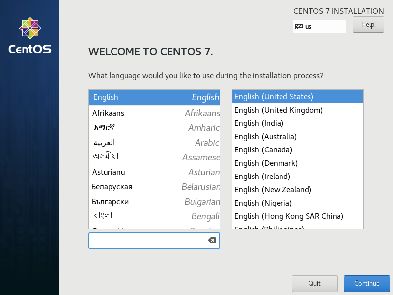
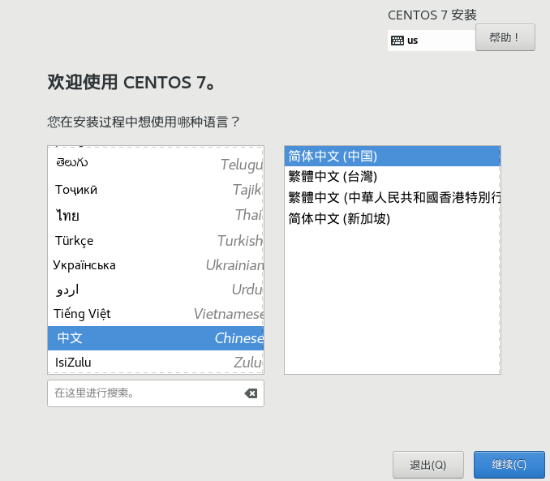
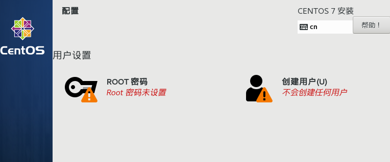
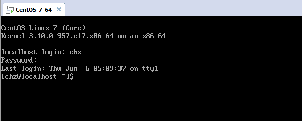
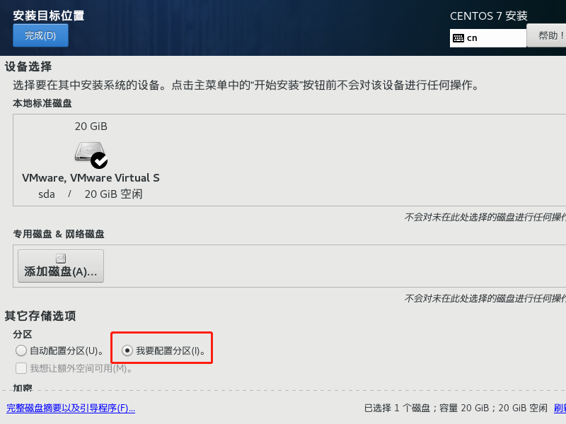
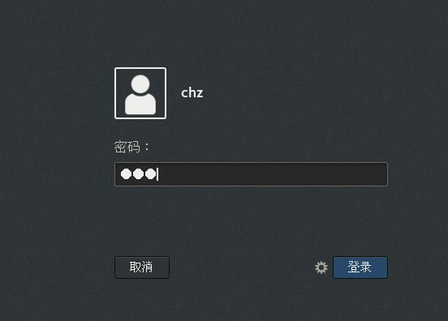
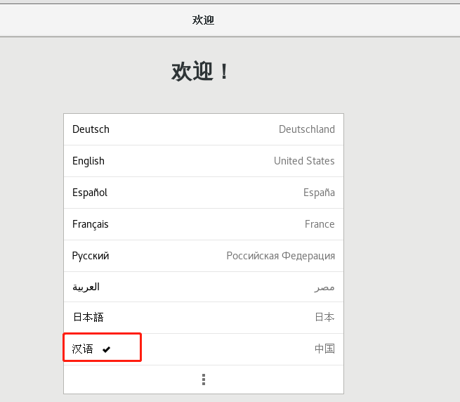
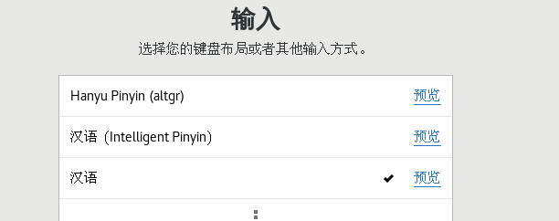
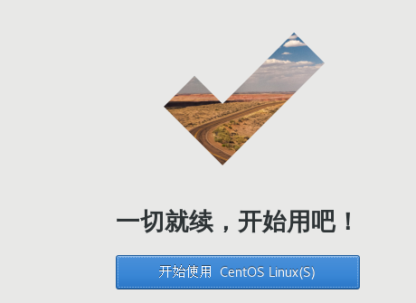

## 前言

​	虚拟机可以使你在一台机器上同时运行多个操作系统，建议安装虚拟机学习使用Linux系统，我们这里选择VMware软件。

​	VMware 是一个“虚拟PC”软件公司.它的产品可以使你在一台机器上同时运行二个或更多Windows、DOS、LINUX系统。安装在VMware操作系统性能上比直接安装在硬盘上的系统低不少，因此，比较适合学习和测试。


## Linux,VM和Windows的关系

​	VM就是一款软件，安装在我们的母机上（Windows），它可以帮我们虚拟一个操作系统出来。首先通过VM来创建一个虚拟机空间，然后在虚拟机空间内安装一个操作系统。

​	安装后的虚拟机系统就是一系列的文件，同样可以把装好后的"一系列文件"移植到别的操作系统上。别的操作系统也必须使用Vm打开，这种移植对测试服务器的压力等非常有帮助。


## 安装VMware


## 使用VMware安装操作系统

### 安装Windows XP示例

1. 选择自定义（高级）


2. 此处镜像文件选择下载的XP镜像（公众号回复：Oracle安装介质）


3. 选择下一步，产品密匙可以在后面XP安装过程填写


4. 选择虚拟机安装的位置


5. 配置相应的参数


6. 此处虚拟机内存务必调成大于800M


7. 选择使用桥接网络


8. 不用做任何改动


9. 不用做任何改动


10. 此处选择创建新虚拟磁盘


11. 指定磁盘大小30G左右，必须勾选立即分配所有磁盘空间，以及勾选将磁盘存储为单个文件


12. 磁盘文件命名 


13. 点击完成


**接下来启动虚拟机就是正常的WindowsXP系统安装流程**


### 安装Linux 

#### 典型安装——Centos示例

> CentOS 是Linux操作系统的一个发行版本，CentOS 7发行版本下载链接：http://mirrors.163.com/centos/7/isos/x86_64/ 选择CentOS-7-x86_64-DVD-1810.iso  下载即可

##### 新建虚拟机

选择择新建虚拟机，选择典型配置，点击下一步，选择安装程序光盘映像文件（iso），浏览目录选择下载好的centos-iso文件。


点击下一步，填写虚拟机名称并选择虚拟机安装位置（也可以默认）


点击下一步，填写指定磁盘容量，这里默认，下一步，点击完成后会自动启动虚拟机。

##### 安装虚拟机


默认选中第二项（检查安装媒体并安装CentOS 7)，将鼠标定向到虚拟机内后可以使用上下方向键选中其他选项，按Enter键，安装CentOS系统，接下来是正常的CentOS系统安装流程。等待一波命令行界面后进入语言选择界面



可以选择多种语言，这里选择简体中文，继续



在安装信息摘要界面如果有提示感叹号的需要点进去处理一下，我这次安装只有安装位置那里显示感叹号，点击安装位置，进去后点击左上角完成按钮，再次回到安装信息摘要界面，全部感叹号消失后点击开始安装




又出现了感叹号，默认不会设置root账户的密码，也不会创建任何新用户。点击Root密码进去设置一个密码，按提示点击完成，然后点击创建用户，设置用户名和密码，设置完成后按提示点击完成，继续等待：


完成


安装成功



##### 注意点

这种模式下安装的系统会有以下问题：

###### 网络配置

有问题

###### 图形界面

centos7默认情况下是不会安装图形界面的，需要自己手动安装，开启系统，以root身份进入，执行命令

```bash
yum groupinstall "X Window System"
···
```

##### 自定义安装信息

###### 自定义分区

进入安装目标位置时选择我要配置分区，可以按以下方式配置



点击完成，选择标准分区


点击"+"号，增加下方的挂载点：/boot ，把容量设置为200 


再添加一个设置：swap ，期望容量：2048，

swap:交换分区，用于系统内存不够用，可用swap暂时的替代系统内存，分配内存的1.5倍-2倍之间。


添加一个分区：/  根分区 ，期望容量不设置，其余的放在根分区。


点击完成，接受更改


###### 自定义预安装选项

可以在这里选择安装图形界面，进入软件选择


选择GNOME桌面，勾选上需要用到的选项


###### 自定义网络和主机名


打开网络连接


修改主机名


##### 自定义安装信息后的步骤

首先同样是进入漫长的等待安装过程，这里安装的软件更多，因此时间也会更久。


这里要点进去选择同意许可协议


选择用户登陆



选择语言（汉语）





下面的都可以跳过，开始使用




##### 网络设置

如果仍然无法上网，按以下步骤操作：

打开终端

键入：**su root**  然后 输入管理员密码，注意密码是不会回显的

输入**cd /etc/sysconfig/network-scripts/**

输入命令 ： **ls** 查看文件，找到文件**ifcfg-ens33**（你们可能不一样，只要是 ifcfg-ensxx就可以）


输入命令  **vi ifcfg-ens33**

进入编辑模式，找到ONBOOT=no，把 ONBOOT=no 修改为 ONBOOT=yes，然后ESC退出编辑模式，输入 **：wq！** 回车完成保存


重新启动CentOS，就可以上网了。


##### 保存快照

对于配置好的虚拟机我们最好保存一个初始快照


### 自定义安装——kali示例


## 虚拟机配置

> 虚拟机在安装好后仍然可以编辑部分配置


### 磁盘容量大小

这里分配不会立马用掉所设置值的磁盘容量，而是随着使用慢慢增加到最大限制。

### 内存大小

根据真实机器的内存进行适当调高，最大不超过真实内存的一半。

### 处理器

数量和核数也可以自由配置，可以在任务管理器中查看Windows真实机器的处理器情况


### 网络配置

推荐使用NAT模式

**桥接模式：**

我们假设有一个教室的网络环境，里面有一台小白的电脑：windows操作系统，IP地址为：192.168.0.**10**；在这个教室中还有另外一个人小黑的电脑windows，192.168.0.**20**，他们可以相互通信。 

小黑的Windows装了一个VM虚拟机，并且安装了CentOS系统，网络设置选择了：**桥接模式**，那么安装的CentOS系统的ip地址也是192.168.0.xx。


小白的电脑可以与小黑的电脑通信，小白的电脑还可以与小黑安装的CentOS虚拟机进行通信。

这样固然好，但是我们学习过网络原理的知识明白，192.168.0.xx网段可分配的地址只有200多个，如果网络环境中主机很多，可能会造成ip地址冲突，所以我们不选择桥接模式。

**NAT模式（建议）：**

Linux可以访问外网，不会造成IP冲突。

假设教室网络环境中又多了一个小绿的主机，它在主机上装了CentOS的操作系统，网络配置选择的NAT模式。


采用NAT模式后，安装虚拟机的Windows会增加一个ip地址，192.168.100.200。

192.168.100.200和192.168.100.50可以通信，这样小绿的电脑有了两个ip地址，采用NAT模式的话，小绿创建的虚拟机的ip地址不会占用192.168.0.xx这个网段。

这种方式不会出现ip冲突，但是小黑小白是无法和小绿安装的CentOS通信的。但是小绿安装的运用NAT模式的CentOS可以和公网（即：小白和小黑的电脑）通信（小绿另一个ip地址代理）。

**仅主机模式：**

虚拟机CentOS是一个独立的主机，不可以访问外网。


## 共享文件夹配置


