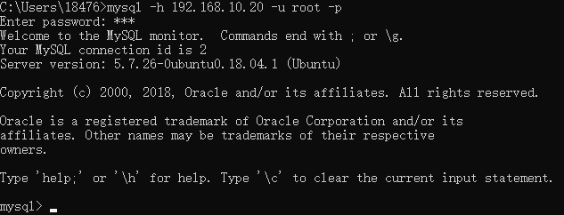
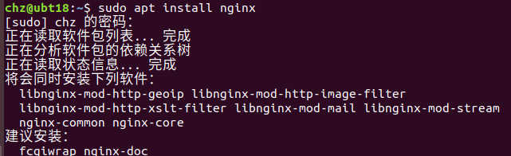

## 安装系统

选择语言：英文

选择直接安装


键盘布局，默认选择英文


后面的也是默认选项，然后就等啊等

安装成功，保存一下快照。


## 安装常用工具

在更换软件源之前千万不要`apt upgrade`，不然卡得要死

安装`ifconfig`命令：`sudo apt install net-tools`

安装`vm-tool`，`vm-tool`必须要在安装完`ifconfig`后再安装

更换阿里云软件源，打开软件和更新，选择中国的服务器，选择阿里云服务器，然后反复执行`sudo apt update`和`sudo apt upgrade`


## 设置系统语言为中文和中文输入法

打开设置


选择区域和语言，管理已安装语言


选择安装（又是一个漫长得过程）


将汉语拖到最上面


点击`+`按钮添加一个汉语拼音输入源


重启，我选择旧名称


中文输入法安装成功


这是现在得语言配置


大功告成，保存快照

## 安装LAMP环境

### apache2

`sudo apt install apache2`


#### 检查apache版本

`apache2 -version`


#### 检查apache服务状态

一般安装完会默认开启：`systemctl status apache2`，按q退出。


`service apache2 status`和`/etc/init.d/apache2 status`命令效果同上

#### apache2在Ubuntu18下的目录结构

##### 系统目录：`/etc/apache2/`


```bash
/etc/apache2/
---- apache2.conf	# 主要配置文件
---- conf-available/	# 附加可用配置文件会放在这个目录下
-------- charset.conf                
-------- other-vhosts-access-log.conf  
-------- serve-cgi-bin.conf
-------- localized-error-pages.conf  
-------- security.conf
---- conf-enabled/	# 附加已生效配置文件会生成一个软连接放在这个目录
-------- charset.conf                
-------- other-vhosts-access-log.conf  
-------- serve-cgi-bin.conf
-------- localized-error-pages.conf  
-------- security.conf
---- sites-available/	# 附加可用虚拟主机配置文件存放在此目录下
-------- 000-default.conf
-------- default-ssl.conf
---- sites-enabled/	# 附加已生效虚拟主机配置文件会生成一个软连接存放在此目录下
-------- 000-default.conf
---- mods-available/ 	# 可用扩展模块存放目录
---- mods-enabled/	# 已生效扩展模块存放目录
 ---- ports.conf   	# 端口配置文件
---- envvars      
---- magic
```

使配置文件生效的命令：`sudo a2enconf 配置文件名去掉.conf后缀`，效果是在`conf-enabled`目录下生成对应配置文件的软链接

使配置文件失效的命令：`sudo a2disconf 配置文件名去掉.conf后缀`，，效果是删除`conf-enabled`目录下对应配置文件的软链接

使虚拟主机配置文件生效的命令：`sudo a2ensite 配置文件名去掉.conf后缀`，效果是在`sites-enabled`目录下生成对应配置文件的软链接

使虚拟主机配置文件失效的命令：`sudo a2dissite 配置文件名去掉.conf后缀`，，效果是删除`sites-enabled`目录下对应配置文件的软链接

使扩展模块生效的命令：`sudo a2enmod 模块名去掉.load后缀`，效果是在`mods-enabled`目录下生成对应配置文件的软链接

使扩展模块失效的命令：`sudo a2dismod 模块名去掉.load后缀`，，效果是删除`mods-enabled`目录下对应配置文件的软链接

配置文件错误检查命令：`sudo apache2ctl configtest`

##### 默认站点目录：`/var/www/html/`

##### 默认日记存放目录：`/var/log/apache2/`

#### 开启 、关闭和重启Apache服务器

有三套命令

```bash
# 开启
systemctl start apache2
service apache2 start
/etc/init.d/apache2 start
# 关闭
systemctl stop apache2  
service apache2 stop
/etc/init.d/apache2 stop
# 重启
systemctl restart apache2   
systemctl reload apache2   
service apache2 restart
/etc/init.d/apache2 restart
```

#### 访问apache2服务

在浏览器中访问本地环回地址`127.0.0.1`或本地IP地址，可用`ifconfig`命令或`hostname -I`命令查看


#### 设置虚拟主机

默认情况下，apache2的服务器目录是`/var/www/html`，上一个步骤访问的就是该目录下的`index.html`文件。


下面在用户家目录下创建一个`webdev/www/test`目录作为虚拟主机目录

```bash
# 创建虚拟主机目录
mkdir -p ~/webdev/www/test
# 添加虚拟主机默认页面
echo hello > ~/webdev/www/test/index.html
# 编辑虚拟主机配置文件
sudo vim /etc/apache2/sites-available/test.com.conf
# 新增以下内容，保存退出
<VirtualHost *:80>
        serverAdmin admin@test.com
        serverName test.com
        serverAlias www.test.com
        DocumentRoot ~/webdev/www/test
        ErrorLog ${APACHE_LOG_DIR}/error.test.log
        CustomLog ${APACHE_LOG_DIR}/access.test.log combined
        <Directory />
            AllowOverride all
            Require all granted
        </Directory>
</VirtualHost>
# 设置虚拟主机配置文件生效，将其链接到`sites-enabled`目录下,ubuntu18可使用`sudo a2ensite test.com`代替，对应的使配置失效的命令是`sudo a2dissite test.com`
sudo ln -s /etc/apache2/sites-available/test.com.conf /etc/apache2/sites-enabled/test.com.conf
# 编辑hosts文件
sudo vim /etc/hosts
# 新增两行，保存退出
127.0.0.1	test.com
127.0.0.1	www.test.com
# 重启apache
sudo service apache2 restart
```

浏览器访问`test.com`和`www.test.com`


**注意：如果不设置`Directory`节点权限，会出现forbidden的情况。**


#### 设置网站默认编码

我们在测试虚拟主机的默认页面上加上一行中文 `echo 测试页面  >> ~/webdev/www/test/index.html`

默认效果如下，出现乱码，这是因为默认编码问题


apache的配置文件还可以设置网站的默认编码

```bash
sudo vim  /etc/apache2/sites-available/charset.conf
# 新增一行，保存退出
AddDefaultCharset UTF-8
# 设置配置文件生效，将其链接到`sites-enabled`目录下,ubuntu18可使用`sudo a2ensite charset`代替，对应的使配置失效的命令是`sudo a2dissite charset`
sudo ln -s /etc/apache2/sites-available/charset.conf /etc/apache2/sites-enabled/charset.conf
# 重启apache
sudo service apache2 restart
```

清除浏览器缓存，访问网站，中文正常显示


### MySQL

#### 安装数据库

```bash
sudo apt install mysql-server
# 查看有没有安装MySQL：
dpkg -l | grep mysql
# 检查是否正在运行
netstat -tap | grep mysql
```

默认安装的是MySQL5.7


#### 连接数据库

1. 如果安装过程中要求输入密码，则使用`mysql -uroot -p`然后输入密码即可进入

2. 如果没提示输入密码，使用`mysql -uroot -p`输入空密码进入

3. 如果没提示输入密码，使用`mysql -uroot -p`输入空密码后连接失败，则使用以下步骤重设密码

    ```bash
    # 查看默认用户和密码
    sudo cat /etc/mysql/debian.cnf 
    ```

    

    ```bash
    # 使用上面的用户和密码登陆
    mysql -udebian-sys-maint -p VDakK5ejndpOUOft
    ```

    

    接着修改密码

    ```sql
    -- 选择数据库
    use mysql;
    -- 修改root用户的密码为123456
    update mysql.user set authentication_string=password('123456') where user='root' and Host ='localhost';
    -- 更新权限
    update user set  plugin="mysql_native_password";
    flush privileges;
    quit;
    ```

    重启数据库服务就可以以root用户进行登陆了

    

#### 设置远程访问权限

默认情况下不允许其他主机远程连接数据库


```bash
# 修改配置文件
sudo vim /etc/mysql/mysql.conf.d/mysqld.cnf
# 注释掉下面这行，保存退出
bind-address          = 127.0.0.1
# 进入mysql数据库，执行授权命令
mysql -u root -p
mysql> grant all on *.* to root@'%' identified by '你的密码' with grant option;
mysql> flush privileges;    # 刷新权限
mysql> quit;
# 重启mysql
sudo systemctl restart mysql
```

现在可以在其他主机连接这个数据库了



当然，也可以使用navicat工具连接

### PHP

#### 安装PHP

```bash
# 安装php
sudo apt install php
# 查看php版本，默认php7.2
php -v
```


新建phpinfo.php文件

```bash
echo "<?php echo phpinfo();" > ~/webdev/www/test/phpinfo.php
```

打开浏览器查看php的信息


设置index.php默认页级别高于index.html

```bash
# 打开/etc/apache2/mods-enabled/dir.conf文件，将index.php置于index.html之前
sudo vim /etc/apache2/mods-enabled/dir.conf
# 重启apache2
sudo service apache2 restart
# 新建index.php文件
echo "<?php echo 'php file';" > ~/webdev/www/test/index.php
```

打开浏览器，默认页面变为php文件


#### 设置PHP错误报告

根据以上步骤安装的php默认不报错，下面设置php报错显示

```bash
# 打开php配置文件
sudo vim /etc/php/7.2/apache2/php.ini
# 将 display_errors = Off 这一行修改为
display_errors = On
# 会报告的错误类型默认值是 error_reporting = E_ALL & ~E_DEPRECATED & ~E_STRICT，也可以根据需要修改
```


#### 开启PHP模块（可选）

##### 与php扩展相关的两个目录


##### 如何开启php扩展

打开php配置文件`sudo vim /etc/php/7.2/apache2/php.ini`，找到下面的内容，去掉想要开启的扩展前面的注释符号即可


##### 安装mysql数据库扩展

先写一个连接数据库的文件

```php
<?php

$conn = mysqli_connect('127.0.0.1','root','***');
var_dump($conn);

$pdo = new PDO('mysql:host=localhost;port=3306;dbname=mysql','root','***');
var_dump($pdo);
```

相对与PHP5，PHP7的最大变化之一是移除了`mysql`扩展，推荐使用`mysqli`或者`pdo_mysql`，默认已经安装`pdo`扩展，但是还没装`mysqli`扩展，这时使用`mysqli`函数是会报错的，提示该函数未被定义


```bash
# 安装mysqli扩展
sudo apt install php7.2-mysql
# 重启apache2
sudo systemctl restart apache2
```


如果仍然报错提示函数未定义，则可能需要修改php配置文件，开启相关扩展

##### 安装curl扩展

```bash
sudo apt-get install php7.2-curl
```

##### 安装mbstring扩展

```bash
sudo apt-get install php7.2-mbstring
```


### PHPMyAdmin

安装：`sudo apt install phpmyadmin`


输入密码


确认密码


安装完成后，创建phpMyAdmin的软链接到网站目录上

```bash
sudo ln -s /usr/share/phpmyadmin /var/www/html/phpmyadmin
```

访问phpmyadmin,输入用户名和密码即可登陆


## 安装其他工具

### 安装nginx

#### 安装

```bash
sudo apt install -y nginx
```



```bash
# 查看版本
nginx -v
```


#### nginx目录

nginx主要目录是`/etc/nginx`

```bash
/etc/nginx        
---- nginx.conf		# 主配置文件
---- conf.d/		# 其他配置文件存放目录
---- sites-available/
---- sites-enabled/
---- modules-available/
---- modules-enabled/
---- fastcgi.conf    
---- mime.types         
---- proxy_params 
---- fastcgi_params   
---- scgi_params      
---- uwsgi_params
---- koi-utf         
---- koi-win  
---- win-utf
---- snippets/
```


#### 解决和apache2的冲突

```bash
# 查看状态
systemctl status nginx
```


因为前面安装了apache2，并且开启了网络服务，占用了80端口，所以nginx起不来。

解决方法：

1. 停掉apache2服务再开启nginx

    ```bash
    sudo systemctl stop apache2
    sudo systemctl start nginx
    systemctl status nginx
    ```

    

2. 不停apache2服务但是要修改nginx的监听端口

    nginx配置文件在`/etc/nginx`目录下的`nginx.conf`。在`nginx.conf->http`选项末尾有引入两个目录下的文件分别为：

    ```bash
    http {
            #   省略部分内容    
            include /etc/nginx/conf.d/*.conf;
            include /etc/nginx/sites-enabled/*;
    }
    ```

    我们查看`/etc/nginx/sites-enabled/`目录，会找到一个`default`文件，在`server`选项下前两行就可以找到使用的80端口号，将80端口号改为想使用的端口号，保存退出

    ```bash
    sudo vim /etc/nginx/sites-enabled/default
    ```

    

    现在同时启动apache2和nginx就没有冲突了

    ```bash
    sudo systemctl restart nginx
    sudo systemctl start apache2
    systemctl status nginx
    systemctl status apache2
    ```

    

浏览器访问nginx站点


咦，怎么和apache2的一样，别急，我们看一眼配置

```bash
sudo vim /etc/nginx/sites-enabled/default
```

找到以下内容


可以发现nginx的默认网站目录也是`/var/www/html`，而且默认访问优先级是`index.html`高于`index.nginx-debian.html`

所以这里只需在端口后面再加上文件名就可以访问nginx的默认页面了


或者我们修改网站目录位置，然后将`index.nginx-debian.html`文件移到新的站点目录下也是可以的。

这里我将其修改为`/var/www/nginx`

```bash
sudo mkdir /var/www/nginx
sudo mv /var/www/html/index.nginx-debian.html /var/www/nginx/index.nginx-debian.html
sudo vim /etc/nginx/sites-enabled/default
# 修改root /var/www/html;为
root /var/www/nginx;
# 保存退出
sudo systemctl restart nginx
```

清除浏览器缓存，这时默认访问`index.nginx-debian.html`文件


##### nginx支持php

nginx提供了对php的支持，但是默认不会开启，如果这时在站点中访问php文件会提示下载：

```bash
sudo vim /var/www/nginx/phpinfo.php
```

```php
<?php echo phpinfo();
```


下面开始配置nginx对php的支持

```bash
# 安装php7.2-fpm
sudo apt install -y php7.2-fpm
# 修改nginx配置
sudo vim /etc/nginx/sites-available/default
# 找到下面的配置
        #location ~ \.php$ {
        #       include snippets/fastcgi-php.conf;
        #
        #       # With php-fpm (or other unix sockets):
        #       fastcgi_pass unix:/var/run/php/php7.0-fpm.sock;
        #       # With php-cgi (or other tcp sockets):
        #       fastcgi_pass 127.0.0.1:9000;
        #}
# 修改成下面这样子
	    location ~ \.php$ {
                include snippets/fastcgi-php.conf;
        #
        #       # With php-fpm (or other unix sockets):
                fastcgi_pass unix:/var/run/php/php7.2-fpm.sock;
        #       # With php-cgi (or other tcp sockets):
        #       fastcgi_pass 127.0.0.1:9000;
        }
# 保存退出，重启nginx
sudo systemctl restart nginx
# 修改php7.2-fpm配置
sudo vim /etc/php/7.2/fpm/php.ini
# 输入\cgi.fix_pathinfo 查询，修改cgi.fix_pathinfo=1为
cgi.fix_pathinfo=0
# 并去掉这一行的注释，保存退出，重启php7.2-fpm
sudo systemctl restart php7.2-fpm
```

浏览器访问phpinfo.php成功


### 安装jdk

Java JDK在linux系统有两个版本，一个开源版本**Openjdk**，还有一个**oracle官方版本jdk**，oracle JDK既可以通过添加ppa源命令行安装，也可以去官网下载jdk压缩包安装。

#### 安装openjdk

```bash
sudo apt install openjdk-8-jdk
java -version
```


#### 安装oracle Java JDK

命令行方式安装oracle Java JDK和手动下载压缩包安装oracle Java JDK可参考<https://blog.csdn.net/zbj18314469395/article/details/86064849>


### 安装python

#### 安装python2环境：

安装python2：`sudo apt install python`


使用`python`命令可进入python2的cli界面

安装pip：`sudo apt install python-pip`


使用`pip`命令安装python包


#### 安装python3环境

安装python3（默认自带）：

`sudo apt install python3`


使用`python3`命令可进入python3的cli界面


安装pip3：`sudo apt install python3-pip`


使用`pip3`命令安装python包（不知道为什么，这里会很慢）


### 安装redis


### 安装ssh

#### 安装

`sudo apt install openssh-server`

#### 使用xshell连接

查询IP地址：`ifconfig`


打开xshell软件新建连接，按下图配置，点击确定


第一次连接，选择接受并保存


输入用户名（登陆系统得用户名）


输入密码（系统用户名对应的密码）


连接成功


### 安装nmap

`sudo apt install nmap`


### 安装vscode

下载地址：https://code.visualstudio.com/Download

用浏览器打开，选择下载deb包，选择软件安装


安装完成后在终端输入`code`命令或者搜索visual studio code双击即可打开软件


安装中文语言包


按F1搜索Configure Display Language，选择zh-cn


要求重启vscode


重启后界面显示为中文


