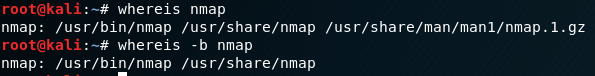
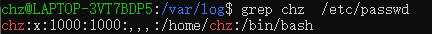
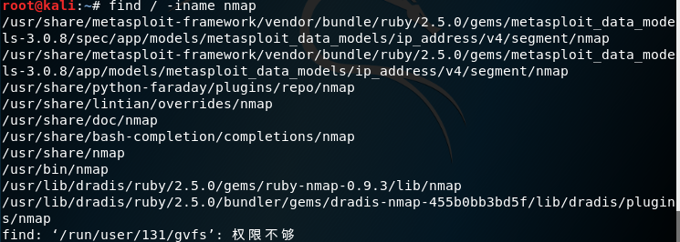
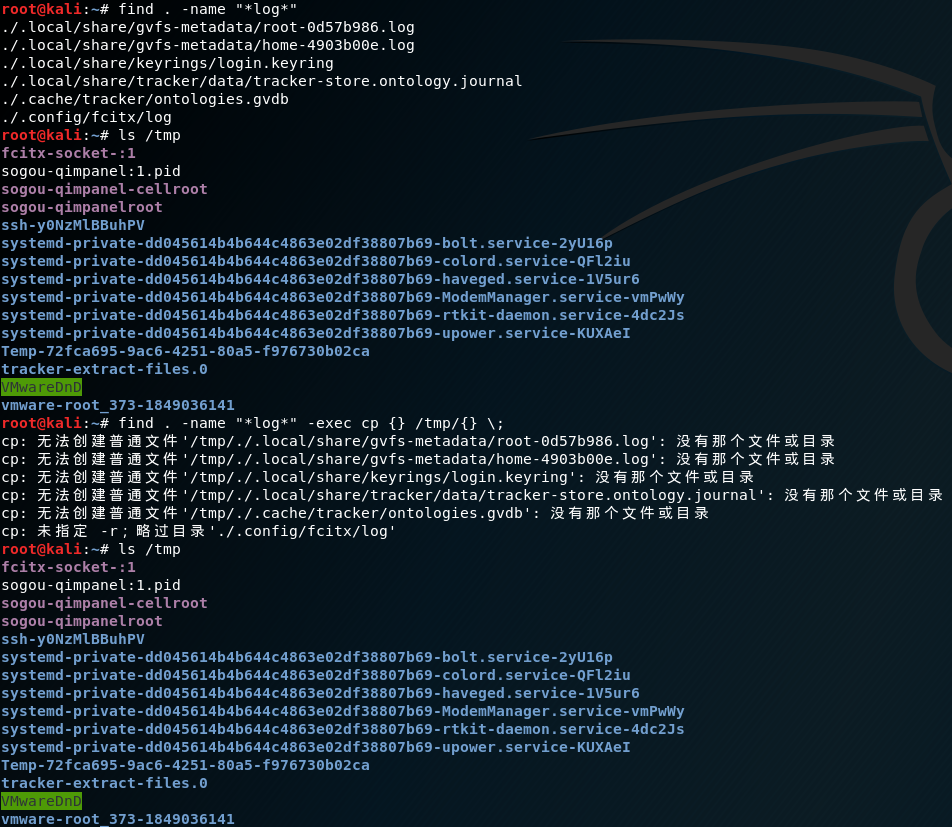

# Linux系统中一切皆文件

## 基本概念

**在Linux中一切皆文件**，包括它的硬件，声卡、硬盘等等都会映射成一个文件来管理。在 Linux 或 Unix 操作系统中，所有的文件和目录都被组织成以一个根节点开始的倒置的树状结构。

文件系统的最顶层是由根目录开始的，系统使用 / 来表示根目录。在根目录之下的既可以是目录，也可以是文件，而每一个目录中又可以包含子目录文件。如此反复就可以构成一个庞大的文件系统。

在Linux文件系统中有两个特殊的目录，一个用户所在的工作目录，也叫**当前目录**，可以使用一个点 **.** 来表示；另一个是当前目录的**上一级目录**，也叫父目录，可以使用两个点 **..** 来表示。在以后学习切换目录相关命令的时候还会接触到。

如果一个目录或文件名以一个点 **.** 开始的，表示这个目录或文件是一个**隐藏目录或文件**(如：**.**bashrc)。即以默认方式查找时，不显示该目录或文件。


## 目录结构


常用目录讲解

/bin ：存放常用指令：cp cat ...

/opt：额外安装软件

/boot：启动Linux使用的核心文件

/dev ：管理设备，把硬件映射成文件，硬件文件如：cpu disk等

/var：包含系统一般运行时要改变的数据。通常这些数据所在的目录的大小是要经常变化或扩充的。原来 /var 目录中有些内容是在 /usr 中的，但为了保持 /usr 目录的相对稳定，就把那些需要经常改变的目录放到 /var 中了。

/lib： 开机需要的基本链接共享库

/media ：U盘等插入，media就会多出文件

/mnt ：挂载别的文件系统

/root：root用户的相关文件

/sbin：高级用户使用的指令

/selinux：安全目录，危机系统安全时触发

/proc：尽量不修改，存放内核相关文件

/home ：创建一个普通用户，会在home下生成对应文件，文件的名就是用户名

/srv：服务启动之后需要提取的相关数据，尽量不修改此文件信息

/etc：系统管理需要的配置文件和子目录

/user：用户安装的应用程序，类似Windows中的program files目录


### 注意

在linux系统中，有几个目录是比较重要的，平时需要注意不要误删除或者随意更改内部文件。

**/etc：** 上边也提到了，这个是系统中的配置文件，如果你更改了该目录下的某个文件可能会导致系统不能启动。

**/usr/bin, /usr/sbin,/bin, /sbin:** 这是系统预设的执行文件的放置目录，比如 ls 就是在/bin/ls 目录下的。

值得提出的是，/bin, /usr/bin 是给系统用户使用的指令（除root外的通用户），而/sbin, /usr/sbin 则是给root使用的指令。

**/var：** 这是一个非常重要的目录，系统中扩充的文件存在这里。系统上跑了很多程序，那么每个程序都会有相应的日志产生，而这些日志就被记录到这个目录下，具体在/var/log 目录下，另外mail的预设放置也是在这里。


## 0  基本目录操作

### 0.1  查看目录内容：ls

| 格式 | ls [选项] [目录]                                             |
| ---- | ------------------------------------------------------------ |
| 功能 | 列出[指定（默认是当前）目录下的所有文件                      |
| 备注 | 选项效果可以叠加，如`ls -al：列出目录下所有文件并展现文件的详细信息`，ls类似Windows平台下的dir命令 |

常用选项：

```bash
不加选项  列出目录下所有非隐藏文件
-a  (--all)  列出目录下所有文件，包括隐藏文件
-A  (--almost-all)  类似-a，但不列出"."和".."
-l  展现文件的详细信息（-rw-rw-rw- 1 chz  chz     0 May 28 00:14 1.c）
-c  根据createdtime排序显示
-t  根据文件修改时间排序
-S  按文件大小排序
--sort==WORD  按指定顺序排序（如`--sort=size`)
-F  使用这个参数表示在文件的后面多添加表示文件类型的符号，例如*表示可执行，/表示目录，@表示连结文件
--color[=WHEN] 用色彩辨别文件类型 WHEN 可以是'never'、'always'或'auto'其中之一
    白色：表示普通文件
    蓝色：表示目录
    绿色：表示可执行文件
    红色：表示压缩文件
    浅蓝色：链接文件
    红色闪烁：表示链接的文件有问题
    黄色：表示设备文件
    灰色：表示其它文件

```


### 0.2  切换目录：cd

| 格式 | cd  [目录]                      |
| ---- | ------------------------------- |
| 功能 | 切换目录                        |
| 备注 | 与Windows平台下的cd命令用法一致 |

用法示例：

| eg       | 说明                                           |
| -------- | ---------------------------------------------- |
| cd /     | 切换到根目录                                   |
| cd -     | 命令后跟一个减号，则会退回到切换前的目录       |
| cd ~     | 当前用户的 home 目录                           |
| cd       | 命令后不指定目录，会切换到当前用户的 home 目录 |
| cd ..    | 切换到上一级目录                               |
| cd /etc/ | 切换到根目录下的etc目录                        |
| cd etc   | 切换到当前目录下的etc目录                      |


### 0.3  显示用户当前工作目录：pwd

basename 和 dirname

basename用于查看文件不含路径的名字，dirname则用于查看文件路径，使用效果我们测试一下便知：

\> basename /home/hj/1.txt

1.txt

\> dirname  /home/hj/1.txt

/home/hj

\> basename 1.txt

1.txt

\> dirname 1.txt


### 0.4  输入输出

### 输出字符：echo 


#### 清屏

clear命令是用来清除当前屏幕显示的，不需任何参数，和dos下的cls命令功能相同。

### 0.5  判断文件类型：file


## 1  查看文件或日志

> 查看文件内容或日志文件，用得最多的就是cat、head、tail命令。


### 1.1  cat

| 格式 | cat [选项] [文件]..                                          |
| ---- | ------------------------------------------------------------ |
| 功能 | 显示或连结一般的ascii文本文件，用于查看文件内容。一次显示整个文件或从键盘创建一个文件或将几个文件合并成一个文件 |
| 备注 | cat是concatenate的简写，类似于dos下面的type命令。            |

常用选项：

```bash
-n  编号文件内容再输出
-E  在结束行提示$
```


| eg                      | 说明                                                        |
| ----------------------- | ----------------------------------------------------------- |
| cat test.log            | 查看test.log文件所有内容                                    |
| cat file1 file2         | 依次显示file1,file2的内容                                   |
| cat file1 file2 > file3 | 把file1, file2的内容结合起来写入（覆盖写入）到file3文件中。 |

**注：tac | 反向显示**

### 1.2  head

head [参数]… [文件]… | 显示档案开头，默认开头10行

```bash
-v  显示文件名
-c number   显示前number个字符,若number为负数,则显示除最后number个字符的所有内容
-number/n (+)number     显示前number行内容，
-n number   若number为负数，则显示除最后number行数据的所有内容
```


| eg                   | 说明                             |
| -------------------- | -------------------------------- |
| head test.log        | 查看test.log文件前几行日志内容   |
| head -n 20 test.log  | 查看test.log文件前20行日志内容   |
| head -n -20 test.log | 查看test.log除了最后20行日志内容 |


### 1.3  tail

tail [必要参数] [选择参数] [文件] | 显示文件结尾内容，查看最后几行(默认最多10行）或实时日志。

```bash
-v  显示详细的处理信息
-q  不显示处理信息
-num/-n (-)num      显示最后num行内容
-n +num 从第num行开始显示后面的数据
-c  显示最后c个字符
-f  循环读取
```


| eg                        | 说明                                               |
| ------------------------- | -------------------------------------------------- |
| tail -f test.log          | 查看test.log文件最后几行日志内容                   |
| tail -f test.log          | 实时查看（会自动刷新）test.log文件最后几行日志内容 |
| tail -f -n 20 test.log    | 实时查看test.log文件最后20行日志内容               |
| tail -n 20 test.log       | 查看test.log文件最后20行日志内容                   |
| tail -n +20 test.log      | 查看test.log文件20行后的所有日志内容               |
| watch -n 2  tail test.log | 每隔两秒刷新                                       |


### 1.4  more

more | 按页查看文章内容，从前向后读取文件，因此在启动时就加载整个文件

```bash
+n  从第n行开始显示
-n  每次查看n行数据
+/String    搜寻String字符串位置，从其前两行开始查看
-c  清屏再显示
-p  换页时清屏
```

`more` -在显示器上阅读文件的过滤器,用于分页显示，more指令可以使超过一页的文件内容分页暂停显示，用户按键后才继续显示下一页。如果一个文件太长，显示内容超出一个屏幕，用cat命令只能看到最后的内容，用more和less两个命令可以分页查看。

### 1.5  less

`less`提供了`more`的模拟并做了增强，可前后移动地逐屏查看文章内容，在查看前不会加载整个文件。less除了有more的功能以外，还可以用方向键往上或往下的滚动文件，更方便浏览阅读。

```
-m  显示类似于more命令的百分比
-N  显示行号
/   字符串：向下搜索“字符串”的功能
?   字符串：向上搜索“字符串”的功能
n   重复前一个搜索（与 / 或 ? 有关）
N   反向重复前一个搜索（与 / 或 ? 有关）
b   向后翻一页
d   向后翻半页
```

less的常用动作命令：

回车键 向下移动一行；

y 向上移动一行；

空格键 向下滚动一屏；

b 向上滚动一屏；

d 向下滚动半屏；

h less的帮助；

u 向上洋动半屏；

w 可以指定显示哪行开始显示，是从指定数字的下一行显示；比如指定的是6，那就从第7行显示；

g 跳到第一行；

G 跳到最后一行；

p n% 跳到n%，比如 10%，也就是说比整个文件内容的10%处开始显示；

/pattern 搜索pattern ，比如 /MAIL表示在文件中搜索MAIL单词；

v 调用vi编辑器；

q 退出less

!command 调用SHELL，可以运行命令；比如!ls 显示当前列当前目录下的所有文件；


### wc命令

该命令用于统计指定文件中的字节数、字数、行数。该命令各选项含义如下：

-l 统计行数

-w 统计字数

-c 统计字节数

这些选项可以组合使用。输出列的顺序和数目不受选项的顺序和数目的影响。总是按下述顺序显示并且每项最多一列。


行数、字数、字节数、文件名

如果命令行中没有文件名，则输出中不出现文件名。

例如：

oracle@hjtest:~> wc 1.txt 2.txt

  460  1679 16353 1.txt

  300  1095 10665 2.txt

  760  2774 27018 总用量

oracle@hjtest:~> wc -l 1.txt

460 1.txt

缺省参数为-lcw，即wc file1 file2命令的执行结果与上面一样。

## 2  复制文件/目录

cp [选项] 源文件或目录 目录或多个源文件 | 将源文件复制至目标文件，或将多个源文件复制至目标目录。

```bash
-r -R 递归复制该目录及其子目录内容
-p  连同档案属性一起复制过去
-f  不询问而强制复制
-s  生成快捷方式
-a  将档案的所有特性都一起复制
```


### 2.1  复制文件：cp

| eg                                   | 说明                                                         |
| ------------------------------------ | ------------------------------------------------------------ |
| cp 1.log 1.txt                       | 复制1.log文件到本目录下并命名为1.txt（前提是本目录下不存在1.txt目录） |
| cp test.log /home/logs               | 复制test.log文件到/home/logs/目录下（前提是/home/logs/目录存在） |
| cp test.log  /home/logs/test.new.log | 复制test.log文件到/home/logs/目录下并重新命名为test.new.log（前提是 /home/logs/test.new.log目录不存在） |


### 2.2  复制文件夹：cp -r

| eg                         | 说明                                                         |
| -------------------------- | ------------------------------------------------------------ |
| cp -r logs/ /home/         | 复制 logs目录及目录下所有文件到/home/目录下，此时该目录会有logs目录 |
| cp -r logs/ /home/newlogs/ | 复制 logs目录及目录下所有文件到/home/newlogs/目录下，并把logs目录重新命名为newlogs，前提是/home/目录没有newlogs目录 |


**注：-r或-R表示循环，循环目录下所有文件和目录。下面所有命令也是如此。**


### 2.3  远程复制：scp

scp [参数] [原路径] [目标路径] | 在Linux服务器之间复制文件和目录

```bash
-v  详细显示输出的具体情况
-r  递归复制整个目录
(1) 复制文件：  
命令格式：  
scp local_file remote_username@remote_ip:remote_folder  
或者  
scp local_file remote_username@remote_ip:remote_file  
或者  
scp local_file remote_ip:remote_folder  
或者  
scp local_file remote_ip:remote_file  
第1,2个指定了用户名，命令执行后需要输入用户密码，第1个仅指定了远程的目录，文件名字不变，第2个指定了文件名  
第3,4个没有指定用户名，命令执行后需要输入用户名和密码，第3个仅指定了远程的目录，文件名字不变，第4个指定了文件名   
(2) 复制目录：  
命令格式：  
scp -r local_folder remote_username@remote_ip:remote_folder  
或者  
scp -r local_folder remote_ip:remote_folder  
第1个指定了用户名，命令执行后需要输入用户密码；  
第2个没有指定用户名，命令执行后需要输入用户名和密码；
eg:
   从 本地 复制到 远程
   scp /home/daisy/full.tar.gz root@172.19.2.75:/home/root 
   从 远程 复制到 本地
   scp root@/172.19.2.75:/home/root/full.tar.gz /home/daisy/full.tar.gz
```


#### 2.3.1  本地服务器复制到远程服务器

| 命令格式                                               | 说明                                                         |
| ------------------------------------------------------ | ------------------------------------------------------------ |
| scp local_file remote_username@remote_ip:remote_folder | 复制本地文件到指定远程目录，指定了用户名，命令执行后需要输入用户密码 |
| scp local_file remote_username@remote_ip:remote_file   | 复制本地文件并重命名为指定远程文件名，指定了用户名，命令执行后需要输入用户密码 |
| scp local_file remote_ip:remote_folder                 | 复制本地文件到指定远程目录，没有指定用户名，命令执行后默认为当前服务器用户名并需要输入用户密码 |
| scp local_file remote_ip:remote_file                   | 复制本地文件并重命名为指定远程文件名，没有指定用户名，命令执行后默认为当前服务器用户名并需要输入用户密码 |


| eg                                                   | 说明                                                         |
| ---------------------------------------------------- | ------------------------------------------------------------ |
| scp test.log root@192.168.130.130:/home/             | 从本地服务器复制test.log至192.168.130.130服务器的/home/目录  |
| scp test.log root@192.168.130.130:/home/20190527.log | 从本地服务器复制test.log至192.168.130.130服务器的/home/目录，并重新命名为20190527.log |

复制目录：加-r参数即可


#### 2.3.2  从远程服务器复制到本地服务器

从远程复制到本地的scp命令与上面的命令雷同，只要将从本地复制到远程的命令后面2个参数互换顺序就行了。

| eg                                                           | 说明                                                         |
| ------------------------------------------------------------ | ------------------------------------------------------------ |
| scp root@192.168.130.130:/home/geshan/test.log  /home/appuser/ | 从192.168.130.130远程服务器的/home/geshan/路径下test.log文件复制到本地服务器/home/appuser/路径 |
| scp -r root@192.168.130.130:/home/geshan/tomcat/  /home/appuser/ | 从192.168.130.130远程服务器的/home/geshan/路径下tomcat文件夹复制到本地服务器/home/appuser/路径 |

**注：ip地址和路径之间（即冒号之间）没有任何空格，否则会报错。当第一次和另外一台服务通信（如复制文件），会提示是否信任，输入yes即可。**


## 3  压缩和解压


### 3.1  .tar格式

tar [主选项+辅选项] 文件或者目录 | 多个目录或档案打包、压缩成一个大档案

```bash
主选项：
   -c  建立打包档案，可搭配 -v 来察看过程中被打包的档名(filename)
   -t  察看打包档案的内容含有哪些档名，重点在察看『档名』就是了；
   -x  解打包或解压缩的功能，可以搭配 -C (大写) 在特定目录解开
辅选项：
   -j  透过 bzip2 的支持进行压缩/解压缩：此时档名最好为 *.tar.bz2
   -z  透过 gzip 的支持进行压缩/解压缩：此时档名最好为 *.tar.gz
   -v  在压缩/解压缩的过程中，将正在处理的文件名显示出来！
   -f filename -f 后面要立刻接要被处理的档名！
   -C 目录   这个选项用在解压缩，若要在特定目录解压缩，可以使用这个选项。
   --exclude FILE：在压缩打包过程中忽略某文件 eg: tar --exclude /home/zenghao -zcvf myfile.tar.gz /home/* /etc
   -p  保留备份数据的原本权限与属性，常用于备份(-c)重要的配置文件
   -P(大写）  保留绝对路径，亦即允许备份数据中含有根目录存在之意；
eg:
   压 缩：tar -jcvf filename.tar.bz2 要被压缩的档案或目录名称
   查 询：tar -jtvf filename.tar.bz2
   解压缩：tar -jxvf filename.tar.bz2 -C 欲解压缩的目录
```


```bash
# 压缩folder文件夹为folder.tar
tar czvf folder.tar folder/
# 压缩file1文件为file1.tar
tar czvf file1.tar file1
# 解压file2.tar文件
tar xzvf file2.tar
```


### 3.2  .gz格式

gzip [-cdtv#] 档名 | 压缩、解压缩，源文件都不再存在

```bash
-d  进行解压缩
-c  将压缩的数据输出到屏幕上
-v  :显示原档案/压缩文件案的压缩比等信息
-#  ：压缩等级，-1最快，但压缩比最差，=9最慢，但压缩比最好
```

gunzip | 解压缩

eg：

```bash
# 压缩file1文件为file1.gz,源文件会消失
gzip file1
# 压缩file2文件为file2.gz,保留源文件
gzip -c file2 > file2.gz
# 解压file1.gz,file1.gz会消失
gunzip file1.gz
```


### 3.3  .tar.gz 和 .tgz格式

```bash
# 压缩单个文件/目录
tar czvf FileName.tar.gz FileName
# 压缩多个文件/目录
tar czvf FileName.tar.gz FileName1 FileName2 DirName3 ...
# 解压
tar zxvf FileName.tar.gz
```


### 3.4  .zip格式

```bash
# 压缩
zip fileName.zip fileName
zip -r fileName.zip folder/
# 或者 zip -r fileName.zip folder1/ folder2/ .....
# 或者 zip -r fileName.zip file1 file2 ...
# 解压
unzip fileName.zip
```

**注：压缩目录时，需加 -r 参数，否则压缩进去的是空目录。压缩多个文件或目录时，文件或目录之间需要空格。**


### 3.5  .rar格式

和zip命令类似，只需把zip改为rar即可。


## 4  文件/目录权限

文件或目录的访问权限分为只读，只写和可执行三种，分别代表可读、可写和可执行。

### 4.1  chmod

用于改变文件或目录的访问权限。用户用它控制文件或目录的访问权限。

```bash
chmod mode fileName
# 或者 
chmod -R mode dirName/
```

其中，mode有很多种表示含义

#### 数字设定法

大部分人看到mode有777或776等权限，这些表示什么呢？

用数字表示属性的含义 :

+ 0表示没有权限

- 1表示可执行权限
- 2表示可写权限
- 4表示可读权限

为了方便，把mode改为abc，其中a,b,c各为一个数字，分别表示user、group及other的权限。r=4，w=2，x=1，r表示Read读，w表示Write写，x表示eXecute。

- 若要rwx属性则4+2+1=7；
- 若要rw-属性则4+2=6；
- 若要r-x属性则4+1=5。


| eg                 | 说明                                     |
| ------------------ | ---------------------------------------- |
| chmod 777 test.log | 把test.log文件修改可读写执行操作         |
| chmod -R 666 logs/ | 把logs目录及目录下所有文件修改为读写操作 |

#### 文字设定法

- u 表示“用户（user）”，即文件或目录的所有者。
- g 表示“同组（group）用户”，即与文件属主有相同组ID的所有用户
- o 表示“其他（others）用户”。
- a 表示“所有（all）用户”。它是系统默认值。

eg:文件 a.txt的访问权限为 rwx-r-xr-x, 要去掉所有用户的执行权限并增加同组用户的写权限,命令是:

```bash
chmod a-x,g+w a.txt
```


注：一般修改文件或目录权限需要超级用户（root）进行修改，否则可能会报权限不足。**


### 4.2  chgrp

改变文件或目录所属的组。

```bash
chgrp groupName fileName
# 或者 
chgrp -R groupName dirName/
```


| eg                    | 说明                                               |
| --------------------- | -------------------------------------------------- |
| chgrp geshan test.log | 把test.log文件所属的组修改为geshan组               |
| chgrp -R geshan logs/ | 把logs目录及该目录下所有文件所属的组修改为geshan组 |


### 4.3  chown

更改某个文件或目录所属的用户。

```bash
chown userName fileName
# 或者 
chown -R userName dirName/
```


| eg                    | 说明                                                 |
| --------------------- | ---------------------------------------------------- |
| chown geshan test.log | 把test.log文件所属用户修改为geshan用户               |
| chown -R geshan logs/ | 把logs目录及该目录下所有文件所属用户修改为geshan用户 |


## 5  写入文件

### 5.1  右重定向符>合>>

">"是右重定向符，表示将左边命令结果当成右边命令的输入，注意：如果右侧文件是一个已存在文件，其原有内容将会被清空，而变成左侧命令输出内容。如果希望以追加方式写入，请改用">>"重定向符。


如果">"左边没有指定文件，如： cat >file1，将会等用户输入，输入完毕后再按[Ctrl]+[c]或[Ctrl]+[d]，就会将用户的输入内容写入file1。


### 5.2  echo命令

echo命令的使用频率不少于ls和cat，尤其是在shell脚本编写中。

语法：echo [-ne][字符串]

功能：echo会将输入的字符串送往标准输出，输出的字符串间以空白字符隔开， 并在最后加上换行符。

参数：

-n 显示字串时在最后自动换行

-e 支持以下格式的转义字符， -E 不支持以下格式的转义字符

/a 发出警告声；

/b 删除前一个字符；

/c 最后不加上换行符号；

/f 换行但光标仍旧停留在原来的位置；

/n 换行且光标移至行首；

/r 光标移至行首，但不换行；

/t 插入tab；

/v 与/f相同；

// 插入/字符；

/nnn 插入nnn（八进制）所代表的ASCII字符；

 

示例：

Oracle@hjtest:~/hgd> echo "123" "456"

123 456

oracle@hjtest:~/hgd> echo "123/n456"

123/n456

oracle@hjtest:~/hgd> echo -e "123/n456"

123

456

oracle@hjtest:~/hgd> echo -E "123/n456"

123/n456

oracle@hjtest:~/hgd> echo -E "123///456"

123//456

oracle@hjtest:~/hgd> echo -e "123///456"

123/456

oracle@hjtest:~/hgd> echo -e "123/100456"

123@456

 

注意事项：

在Linux使用的bash下，单引号’’和双引号是有区别的，单引号忽略所有的转义，双引号不会忽略以下特殊字符：

Dollar signs ($)，Back quotes (`)，Backslashes (/)，Excalmatory mark(!)


示例如下：

oracle@hjtest:~> echo "`TEST`"

-bash: TEST: command not found

oracle@hjtest:~> echo '`TEST`'

```
TEST
```

oracle@hjtest:~> echo "$TEST"

​        

oracle@hjtest:~> echo '$TEST'

$TEST

oracle@hjtest:~> echo "//TEST"

/TEST

oracle@hjtest:~> echo '//TEST'

//TEST

oracle@hjtest:~> echo "Hello!"

echo "Hello"

Hello

oracle@hjtest:~> echo 'Hello!'

Hello!


### 5.3  nl命令

nl [选项]… [文件]… | 将输出内容自动加上行号 

```bash
-b 
-b a 不论是否有空行，都列出行号（类似 cat -n) 
-b t 空行则不列行号（默认） 
-n 有ln rn rz三个参数，分别为再最左方显示，最右方显示不加0，最右方显示加0
```


5.4  vi/vim编辑文件

```bash
:w filename 将文章以指定的文件名保存起来  
:wq 保存并退出
:q! 不保存而强制退出
命令行模式功能键
1）插入模式
   按「i」切换进入插入模式「insert mode」，按"i"进入插入模式后是从光标当前位置开始输入文件；
   按「a」进入插入模式后，是从目前光标所在位置的下一个位置开始输入文字；
   按「o」进入插入模式后，是插入新的一行，从行首开始输入文字。

2）从插入模式切换为命令行模式
 按「ESC」键。
3）移动光标
　　vi可以直接用键盘上的光标来上下左右移动，但正规的vi是用小写英文字母「h」、「j」、「k」、「l」，分别控制光标左、下、上、右移一格。
　　按「ctrl」+「b」：屏幕往"后"移动一页。
　　按「ctrl」+「f」：屏幕往"前"移动一页。
　　按「ctrl」+「u」：屏幕往"后"移动半页。
　　按「ctrl」+「d」：屏幕往"前"移动半页。
　　按数字「0」：移到文章的开头。
　　按「G」：移动到文章的最后。
　　按「$」：移动到光标所在行的"行尾"。
　　按「^」：移动到光标所在行的"行首"
　　按「w」：光标跳到下个字的开头
　　按「e」：光标跳到下个字的字尾
　　按「b」：光标回到上个字的开头
　　按「#l」：光标移到该行的第#个位置，如：5l,56l。

4）删除文字
　　「x」：每按一次，删除光标所在位置的"后面"一个字符。
　　「#x」：例如，「6x」表示删除光标所在位置的"后面"6个字符。
　　「X」：大写的X，每按一次，删除光标所在位置的"前面"一个字符。
　　「#X」：例如，「20X」表示删除光标所在位置的"前面"20个字符。
　　「dd」：删除光标所在行。
　　「#dd」：从光标所在行开始删除#行

5）复制
　　「yw」：将光标所在之处到字尾的字符复制到缓冲区中。
　　「#yw」：复制#个字到缓冲区
　　「yy」：复制光标所在行到缓冲区。
　　「#yy」：例如，「6yy」表示拷贝从光标所在的该行"往下数"6行文字。
　　「p」：将缓冲区内的字符贴到光标所在位置。注意：所有与"y"有关的复制命令都必须与"p"配合才能完成复制与粘贴功能。

6）替换
　　「r」：替换光标所在处的字符。
　　「R」：替换光标所到之处的字符，直到按下「ESC」键为止。

7）回复上一次操作
　　「u」：如果您误执行一个命令，可以马上按下「u」，回到上一个操作。按多次"u"可以执行多次回复。

8）更改
　　「cw」：更改光标所在处的字到字尾处
　　「c#w」：例如，「c3w」表示更改3个字

9）跳至指定的行
　　「ctrl」+「g」列出光标所在行的行号。
　　「#G」：例如，「15G」，表示移动光标至文章的第15行行首。
```


## 6  移动/重命名文件/目录

移动文件规则类似复制文件，移动目录时不需要-r参数

mv [选项] 源文件或目录 目录或多个源文件 | 移动或重命名文件

```bash
-b  覆盖前做备份
-f  如存在不询问而强制覆盖
-i  如存在则询问是否覆盖
-u  较新才覆盖
-t  将多个源文件移动到统一目录下，目录参数在前，文件参数在后
eg:
   mv a /tmp/ 将文件a移动到 /tmp目录下
   mv a b 将a命名为b
   mv /home/zenghao test1.txt test2.txt test3.txt
```


## 7  创建/删除文件/目录

touch file 新建文件,touch [选项] 文件 | 创建空文件或更新文件时间

```bash
-a  只修改存取时间
-m  值修改变动时间
-r  eg:touch -r a b ,使b的时间和a相同
-t  指定特定的时间 eg:touch -t 201211142234.50 log.log 
   -t time [[CC]YY]MMDDhhmm[.SS],C:年前两位
```


mkdir dir 新建目录

```bash
-p  递归创建目录，若父目录不存在则依次创建
-m  自定义创建目录的权限  eg:mkdir -m 777 hehe
```


mkdir -p 1/2/3 若指定路径的父目录不存在则一并创建

rmdir dir 删除空目录

```bash
-p  若自父母删除后父目录为空则一并删除
```


rm file 删除文件,rm [选项] 文件… | 一个或多个文件或目录

```bash
-r  删除文件夹
-f  删除不提示
-i  删除提示
-v  详细显示进行步骤
```


rm -r dir 递归删除目录

rm -rf dir 递归删除目录并自动忽略确认提示

rm -d  删除空目录

**linux下删除的文件是不能恢复的**


## 8  匹配/查找

### 8.1  which：which 系统命令名称

查找系统命令（可执行文件）位置，即在PATH变量指定的路径中查看系统命令是否存在及其位置，如：`which apt`，结果：`/usr/bin/apt`

### 8.2  whereis：whereis [-bmsu] [BMS 目录名 -f ] 文件名

**查找前使用`updatedb`命令更新包管理系统数据库可以查找到最新的内容**

定位可执行文件、源代码文件、帮助文件在文件系统中的位置

```bash
-b   定位可执行文件。
-m   定位帮助文件。
-s   定位源代码文件。
-u   搜索默认路径下除可执行文件、源代码文件、帮助文件以外的其它文件。
-B   指定搜索可执行文件的路径。
-M   指定搜索帮助文件的路径。
-S   指定搜索源代码文件的路径。
```

`wheris nmap`、`wheris -b nmap`



### 8.3  grep ：grep ‘正则表达式’ 文件名

eg：`grep chz  /etc/passwd | 显示包含/etc/passwd文件中包含chz的行`



用正则表达式搜索文本，并把匹配的行打印出来，grep是（global search regular expression(RE) and print out the line的缩写，用于从文件面搜索包含指定模式的行并打印出来，它是一种强大的文本搜索工具，支持使用正则表达式搜索文本。grep的工作方式是这样的，它在一个或多个文件中搜索字符串模板。如果模板包括空格，则必须被””引用，模板后的所有字符串被看作文件名。搜索结果送到屏幕，不影响原文件内容。

grep可用于shell脚本，因为grep通过返回一个状态值来说明搜索的状态，如果模板搜索成功，则返回0，如果搜索不成功，则返回1，如果搜索的文件不存在，则返回2。我们利用这些返回值就可进行一些自动化的文本处理工作。

```bash
-c  只输出匹配行的计数。
-I  不区分大小写(只适用于单字符)。
-l  只显示文件名
-v  显示不包含匹配文本的所有行。
-n  显示匹配行数据及其行号
```


示例：

$ ls -l | grep '^a'

通过管道过滤ls -l输出的内容，只显示以a开头的行。

$ grep 'test' d*

显示所有以d开头的文件中包含test的行。

$ grep 'test' aa bb cc

显示在aa，bb，cc文件中匹配test的行。

$ grep '[a-z]/{5/}' aa

显示所有包含每个字符串至少有5个连续小写字符的字符串的行。

$ grep 'w/(es/)t.*/1' aa


如果west被匹配，则es就被存储到内存中，并标记为1，然后搜索任意个字符（.*），这些字符后面紧跟着另外一个es（/1），找到就显示该行。如果用egrep或grep -E，就不用"/"号进行转义，直接写成'w(es)t.*/1'就可以了。

 

### 8.4  find：find [PATH] [option] [action]

在目录层次结构中搜索文件，在文件树种查找文件，并作出相应的处理

```bash
选项与参数：
1. 与时间有关的选项：共有 -atime, -ctime 与 -mtime 和-amin,-cmin与-mmin，以 -mtime 说明
   -mtime n ：n 为数字，意义为在 n 天之前的『一天之内』被更动过内容的档案；
   -mtime +n ：列出在 n 天之前(不含 n 天本身)被更动过内容的档案档名；
   -mtime -n ：列出在 n 天之内(含 n 天本身)被更动过内容的档案档名。
   -newer file ：file 为一个存在的档案，列出比 file 还要新的档案档名

2. 与使用者或组名有关的参数：
   -uid n ：n 为数字，这个数字是用户的账号 ID，亦即 UID
   -gid n ：n 为数字，这个数字是组名的 ID，亦即 GID
   -user name ：name 为使用者账号名称！例如 dmtsai
   -group name：name 为组名，例如 users ；
   -nouser ：寻找档案的拥有者不存在 /etc/passwd 的人！
   -nogroup ：寻找档案的拥有群组不存在于 /etc/group 的档案！

3. 与档案权限及名称有关的参数：
   -name filename：搜寻文件名为 filename 的档案（可使用通配符）
   -size [+-]SIZE：搜寻比 SIZE 还要大(+)或小(-)的档案。这个 SIZE 的规格有：
       c: 代表 byte
       k: 代表 1024bytes。所以，要找比 50KB还要大的档案，就是『 -size +50k 』
   -type TYPE ：搜寻档案的类型为 TYPE 的，类型主要有：
       一般正规档案 (f)
       装置档案 (b, c)
       目录 (d)
       连结档 (l)
       socket (s)
       FIFO (p)
   -perm mode ：搜寻档案权限『刚好等于』 mode的档案，这个mode为类似chmod的属性值，举例来说，-rwsr-xr-x 的属性为4755！
   -perm -mode ：搜寻档案权限『必须要全部囊括 mode 的权限』的档案，举例来说，
       我们要搜寻-rwxr--r-- 亦即 0744 的档案，使用-perm -0744，当一个档案的权限为 -rwsr-xr-x ，亦即 4755 时，也会被列出来，因为 -rwsr-xr-x 的属性已经囊括了 -rwxr--r-- 的属性了。
   -perm +mode ：搜寻档案权限『包含任一 mode 的权限』的档案，举例来
       说，我们搜寻-rwxr-xr-x ，亦即 -perm +755 时，但一个文件属性为 -rw-------也会被列出来，因为他有 -rw.... 的属性存在！
4. 额外可进行的动作：
   -exec command ：command 为其他指令，-exec 后面可再接额外的指令来处理搜寻到的结果。
   -print ：将结果打印到屏幕上，这个动作是预设动作！
   eg:
       find / -perm +7000 -exec ls -l {} ; ,额外指令以-exec开头，以;结尾{}代替前面找到的内容
   | xargs 
       -i  默认的前面输出用{}代替 
       eg:
           find . -name "*.log" | xargs -i mv {} test4
```


从根目录开始查找nmap文件：`find / -name nmap`

不区分大小写查找：`find / -iname nmap`



查找文件并拷贝：`find . -name "*log*" -exec cp {} /tmp/{} \;`

由于只能拷贝非隐藏文件，这里的拷贝会失败




whereis和find的区别：

+ whereis从包管理系统数据库中查找，find从文件系统中查找
+ whereis比find快
+ whereis查找结果不完整，可能比find少


### 8.5  locate

通过搜寻数据库快速搜寻档案

```bash
-r  使用正规运算式做寻找的条件
```


## 9  查看当前目录路径

pwd


## 10  检查目标是文件/目录

test - 检查文件类型并比较

+ -d 检查此file是否是一个目录

- -e 检查此file是否存在
- -f 检查此file是否为一般的文件


## 数据处理

### cut

```
-b ：以字节为单位进行分割。这些字节位置将忽略多字节字符边界，除非也指定了 -n 标志。
-c ：以字符为单位进行分割。
-d ：自定义分隔符，默认为制表符。
-f  ：与-d一起使用，指定显示哪个区域。
```


### sort


```
-n   依照数值的大小排序。
-o<输出文件>   将排序后的结果存入指定的文件。
-r   以相反的顺序来排序。
-t<分隔字符>   指定排序时所用的栏位分隔字符。
-k  选择以哪个区间进行排序。
```

### wc 统计指定文件中的字节数、字数、行数, 并将统计结果显示输出


```
-l filename 报告行数
-c filename 报告字节数
-m filename 报告字符数
-w filename 报告单词数
```

### uniq 去除文件中相邻的重复行


```
-c或——count：在每列旁边显示该行重复出现的次数；
-d或--repeated：仅显示重复出现的行列；
-f<栏位>或--skip-fields=<栏位>：忽略比较指定的栏位；
-s<字符位置>或--skip-chars=<字符位置>：忽略比较指定的字符；
-u或——unique：仅显示出一次的行列；
-w<字符位置>或--check-chars=<字符位置>：指定要比较的字符。
```

awk

```
-F 分隔符  以分隔符分隔内容
{}  要执行的脚本内容 eg:cat /etc/passwd |awk  -F ':'  '{print $1""$7}'
```

sed 对数据行进行替换、删除、新增、选取等操作

```
a   新增，在新的下一行出现
c   取代，取代 n1,n2 之间的行 eg: sed '1,2c Hi' ab
d   删除
i   插入，在新的上一行出现
```


## ln [参数] [源文件或目录] [目标文件或目录] | 某一个文件在另外一个位置建立一个同步的链接

```
-s  建立软连接   
-v  显示详细的处理过程
```

## diff [参数] [文件1或目录1] [文件2或目录2] | 比较单个文件或者目录内容

```
-b 　不检查空格字符的不同。
-B 　不检查空白行。
-i  不检查大小写
-q  仅显示差异而不显示详细信息
eg: diff a b > parch.log 比较两个文件的不同并产生补丁
```


## paste 合并文件，需确保合并的两文件行数相同

```
-d  指定不同于空格或tab键的域分隔符
-s  按行合并，单独一个文件为一行
```


