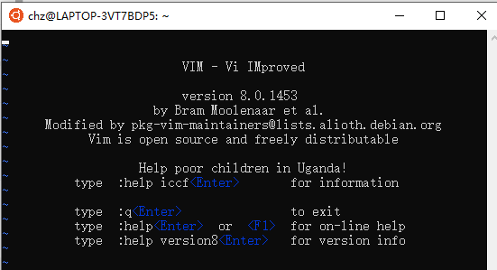

## 简介

Linux 系统下的文本编辑器有很多种，包括图形模式下的gedit、kwrite等，文本模式下的vi、vim（vi的增强版本）、emacs等。其中vi和emacs是Linux系统中最常用的两个编辑器。

Linux系统会内建 vi 文本编辑器，Vim具有程序编程的能力，可以看作是Vi的增强版本，可以主动的以字体颜色辨别语法的正确性，方便程序设计、补充代码、编译及错误跳转等方便编程的功能丰富，被使用者广泛使用。

| eg          | 说明                                                         |
| ----------- | ------------------------------------------------------------ |
| vi 1.txt    | 打开1.txt文件，没有则创建                                    |
| vi -R 1.txt | 以只读方式打开1.txt文件                                      |
| vi -x 1.txt | d对文件加密，以后打开文件需要密码验证                        |
| vi          | 没有给出文件名，也没有给出任何参数<br><br>窗口中央给出的是vi编辑器的使用帮助，当用户在vi中输入文本或执行命令时，<br>该帮助信息会自动消失。另外，如果以这种方式打开vi编辑器，在保存文件时，<br>需要指定文件名。 |


## vi / vim三种工作模式

vi有3种工作模式：普通模式、编辑模式和命令模式，这3种模式之间可以相互切换


### 普通模式

正常模式下我们可以使用快捷键，用vim打开一个档案就直接进入默认模式（普通模式)。此模式你可以使用上下左右按键来移动光标；使用删除字符或删除整行来处理档案内容。同样可以使用复制、粘贴来处理文件数据。

在普通模式下，从键盘输入任何字符都被当作命令来解释。普通模式下没有任何提示符，当输入命令时立即执行，不需要回车，而且输入的字符不会在屏幕上显示出来。

普通模式下可以输入命令进行光标的移动，字符、单词、行的复制、粘帖以及删除等操作。

### 编辑模式

按需 i，I，o，O，a，A，r，R等任何一个字母进入编辑模式，常使用 i 键。

编辑模式主要用于文本的输入。在该模式下，用户输入的任何字符都被作为文件的内容保存起来，并在屏幕上显示出来。在普通模式下，输入a（附加命令）、c（修改命令）、i（插入命令）、o（另起新行）、r（取代命令）以及s（替换命令）都将进入编辑模式，此时vi窗口的最后一行会显示“插入”。输入i命令时屏幕上并无变化，但是通过执行i命令，编辑器由普通模式切换为编辑模式。

 要返回到普通模式，只需按键Esc即可。

### 命令行模式

命令行模式中提供相关的指令，用来完成读取、存储、替换、离开、显示行号等等。

命令模式下，用户可以对文件进行一些附加处理。尽管普通模式下的命令可以完成很多功能，但要执行一些如字符串查找、替换、显示行号等操作还是必须要进入命令模式的。

在普通模式下输入冒号即可进入命令模式，此时vi窗口的状态行会显示出冒号，等待用户输入命令。用户输入完成后，按回车执行，之后vi编辑器又返回到普通模式下。

## 文件的保存和退出

**命令模式**下也就是编辑模式按下esc后有3个常用的用来保存或者退出的命令：

- **：q！**直接退出，不保存。
- **：q**   只是打开看看不做任何修改时使用此命令， 如果修改了想要退出会提示没有保存，必须加上 **！** 强制执行。
- **：wq** 打开后做了修改，而且想要保存使用此命令。


## 光标移动

### 1、向前移动字符

将光标向前移动一个字符可以使用命令为：l、Space键或方向键←。如果在命令前加一个数字n，就是将光标向前移动n个字符。但是要注意：光标的移动不能超过当前行的末尾，当然如果给出的数字超过当前光标到行末尾的字符个数，那么也只能移到行尾。


### 2、向后移动字符

将光标向后移动一个字符可以使用命令为：h、空格键或方向键→。同上面类似，如果在命令前加一个数字n，就将光标向后移动n个字符，而且光标不能超出行首。

### 3、移到下一行

将光标移到下一行可以用的命令：+、Enter键、j、Ctrl+n或方向键↓。这些命令之间是有差别的，+和Enter键是将光标移到下一行的行首，其余命令仅是移到下一行，所在的列不变。如果下一行比当前光标所在位置还短，则下标到行尾。


### 4、移到上一行

将光标上移一行可以使用的命令：-、k、Ctrl+p或方向键↑。同上面的命令类似，-命令将光标移到上一行行首，而另外3个保持在同一列。

### 5、移至行首


将光标移到当前行的行首使用的命令为0和\^。这两个命令在使用时的差别在于命令0是将光标移到当前行的第一个字符，不管它是否为空白符，而命令\^将光标移到当前行的第一个非空白符。


### 6、移至行尾


将光标移到当前行的行尾使用的命令为$。光标移至行尾后，停留在最后一个字符上，如果在该命令前加数字n，则光标将下移到n-1行的行尾。


### 7、按词前移

将光标按词前移使用的命令为w和W。这两个命令都是将光标向前移至下一个单词的开头，它们的区别在：命令w搜索词被定义为以标点符号或空白符（如制表符、换行符或空格符）分隔的字母或数字串；而命令W搜索的词被定义为非空白符字符串。例如有字符串：

echo l > /proc/sys/net/ipv4/conf/default/rp_filter

连续输入命令w，光标从行首移动的位置为：e、l、>、/、p、s、…、/、r、r。

而命令W，光标从行首移动的位置为：e、l、>、/、r。

### 8、按词后移

将光标后移的命令是b和B，这两个命令都是将光标后移至上一个单词的开头，同样，他们对词的定义是有区别的。

### 9、移至词尾

将光标移至当前字符所在词尾的命令是e和E。它们对词的定义与上面的类似。

### 10、移至指定行

将光标移至指定行的开头可以用命令如下：

- `:`+`行号`
- `行号`+`G`

注意：第一个命令是在命令模式下执行的，而非普通模式。

如果没给出行号要显示行号可以用如下命令显示行号：`:set number`、`:set nu`

隐藏行号：`:set nonumber`、`:set nonu`


### 11  首末行

- 在**默认模式**下，输入**G**命令会跳的末尾
- 输入**gg**回到首行


##  屏幕滚动

在vi编辑器中，尽管可以使用键盘上的Page Up键和Page Dawn键来完成这些操作，甚至使用方向键↑和↓，但是效率比较低，下面来看看相关屏幕滚动的命令。

### 1、向后滚动一屏

使用的命令为：Ctrl+f （滚屏后保留上一屏的最后两行）

####  

### 2、向后滚动半屏

使用的命令为：Ctrl+d

####  

### 3、向前滚动一屏

使用的命令为：Ctrl+b

####  

### 4、向前滚动半屏

使用的命令为：Ctrl+u

####  

### 5、屏幕定位

使用命令zz将当前行置为屏幕正中央，使用命令zt会将当前行置为屏幕顶端，命令zb则会将当前行置于屏幕底端。


将屏幕直接定位于文件第一屏或最后一屏也是经常遇到的问题，命令gg和G可以完成这样的功能，使用完这些命令后，光标会定位到第一屏的第一行或最后一屏的最后一行上。


## 文本输入、删除与修改

#### **1、插入命令**


文本的插入命令为i和I。其中i是将其后输出的字符插入到当前光标位置之前。命令I是将其后输入的字符插入到当前光标所在行的行首。

####  

#### **2、附加命令**


附加文本的命令为a和A，其中命令a是将其后输入的字符插入到当前光标位置之后，而命令A则是将其后输入的字符追加到当前光标所在行的行尾。

####  

#### **3、另起新行**


另起新行的命令为o和O，其中命令o是在当前行的下面另起一行，命令O是在当前行的上面另起一行。新行创建完后，光标停留在新行行首，等待输入文字。

####  

#### **4、删除字符**


删除字符的命令为x和X。其中命令x删除光标所在处的字符，而命令X删除光标前面的那个字符。如果之前给出一个数字n，则删除由光标所在字符开始向右的n个字符。


#### **5、删除文本对象**


命令dd删除光标所在的行，命令D删除从光标所在位置开始到行尾的所有字符。


字母d可以与光标移动命令组合，例如：


- d^：从光标位置删至行首，不包括光标位。
- d$：从光标位置删至行尾，包括光标位，与D作用相同。
- dG：删除当前行至文件尾的内容。
- Dgg：删除当前行至文件头的内容。

 **删除**

- **dd**  删除当前行
- **5dd**  删除当前行向下的5行（命令模式下执行）

#### **6、修改命令**


修改文本的命令为c、C和cc，它们的作用是用新输入的文本取代原来的文本，这等价于将原来的文本删除后，利用命令i插入新的文本。

例如有一字符串：Hello World!


假设光标当前处在e处，输入命令cw后，屏幕显示如下：


H World!

此时光标处在H后的空格处，接着输入文本i后按Esc键，屏幕显示如下：


Hi World!

从上面可以看出，cw只是修改光标当前位置到词尾的字符，如果要修改整个单词，可以使用命令caw。


C命令用来修改从光标位置到行尾的文本。如果在前面加一个数字n，那么会把从当前光标位置至当前行下面的n-1行的内容都删除。


命令cc的功能和C相同，只是修改的范围不同，它修改光标所在的整行内容。

####  

#### **7、取代命令**


取代文本的命令为r和R。其中命令r是用其后输入的单个字符取代光标所在的字符，如果在r前加一个数字n，则用其后输入的单个字符取代光标所在处开始向后的n个字符。


R命令用其后输入的文本取代光标所在处开始的若干个字符，每输入一个字符就取代原有的一个字符，多出的部分附加在后面。


## 复制与粘帖

> vi编辑器中的缓冲区分为无名缓冲区和命名缓冲区。无名缓冲区以数字编号，一共有9个。前面讲过可以使用删除命令x和dd来删除文本，其实被删除的内容还保存在缓冲区中，最近一次删除的内容被保存在缓冲区1中，次近的在缓冲区2中，以此类推，我们可以使用命令把他们提取回来。

### 复制

命名缓冲区是以字母a~z命名的，利用命名缓冲区可以很好地保存若干文本段，便于以后存取、移动或者重排。访问这些缓冲区时，和前面一样，使用单个双引号。

**复制文本的命令有如下两种格式：**

yy

y<光标移动命令>

其中yy表示复制整行内容，而后者则通过光标移动命令来限定被复制的文本，如果没有指定缓冲区的名字，文本就被插入到无名缓冲区中。如果用大写字母表示缓冲区，则文本就附加到该缓冲区中，缓冲区中原有的内容不会被覆盖。

**5yy** 拷贝当前行向下的5行

### 粘帖

粘帖缓冲区内容的命令是p和P，这两个命令的区别是：命令p将文本放在当前行之下或当前光标之后，而命令P将文本放在当前行之上或光标之前。

例：使用vi编辑器打开如下文件，然后进行删除和粘帖操作。

```txt
case 5：
case 4：
case 3：
case 2：
case 1：
case 0：
```

假设光标当前出在第2行，连续执行dd命令4次，屏幕如下：

```txt
case 5：
case 0：
```

输入命令p，则在屏幕显示如下：

```txt
case 5：
case 0：
case 1：
```

输入命令”3p，则屏幕显示如下：

```txt
case 5：
case 0：
case 1：
case 3：
```


注意：”3用来引用缓冲区3，单个双引号后紧跟缓冲区的编号。


### 不使用缓冲区的复制与移动


使用的命令为co，它的基本格式如下：


:<开始行>,<结束行> co <目标行>

这个命令在命令模式下执行，其中开始行和结束行标识了文本复制的范围，而目标行则是文本粘帖的位置。


## 查找与替换


### 查找

/str向前查找字符串str，并将光标定位在str的第一个字母上，方便继续操作，按下“/”键后光标跳到vi窗口的最后一行，然后等待输入要查找的字符串，输入完成后按Enter键开始搜索，这时编辑器会高亮显示搜索结果。接下来可以使用命令n来实现光标在搜索结果中移动。


命令?与/的工作方式相同，只有搜索方向相反。


使用上面介绍的命令，例如/the来查找时，可能需要搜索匹配单词soothe和there，这时需要使用如下的形式：

/\<the\>


同理，要匹配一行的开头与结尾需要使用^和$字符，例如：

big$


这个命令只能匹配到一行末尾的单词big。

:set ignorecase


如果不关心目标字符串中的大小写，可以用上面的命令来设置。

:set nowrapscan


上面的命令是在输入目标字符串的过程中vi就开始搜索工作，即就是未完成输入事就能找到目标。

在文件中查找某个单词：进入命令行模式，**/关键字** 回车即可。输入 **n** 查找匹配的下一个。

比如：**/hello**  查找文件中hello字段，按下n会一个个的查找。

### 替换命令


使用的命令为s和S，其中命令s用随后输入的文本替换光标所在处的字符。命令S将新输入的文本替换当前整行。

### 全局替换

全局替换命令有几种常用的格式：


g/s1/s//s2/


将包含字符串s1的所有行中用字符串s2替换s1的首次出现，即就是将所有行中第一次出现的s1替换为s2。


例如程序如下：

```c
int main()
{
    int x;
    for(x=1;x<=10;x++)
        printf(“%d\n”,x);
    return 0;
}
```


输入命令g/x/s//abc/后，上面的程序变为：

```c
int main()
{
    int abc;
    for(abc =1; abc <=10; abc ++)
        printf(“%d\n”, abc);
    return 0;
}
```


可以看到每行中存在x的第一次出现处都被换为abc。

如果要将文件中的所有字符串s1都替换为字符串s2，则使用如下命令：

g/s1/s//s2/g


例如程序如下：

```c
int main()
{
    int x;
    for(x=1;x<=10;x++)
        printf(“%d\n”,x);
    return 0;
}
```


输入命令g/x/s//abc/g后，上面的程序变为：

```c
int main()
{
    int abc;
    for(abc =1; abc <=10; abc ++)
        printf(“%d\n”, abc);
    return 0;
}
```


可以看到所有的x都被替换为abc了。

`g/s1/s``//s2/gc`

该命令基本与上面的功能相同，只是在替换之前给出提示要求确认，如果回答y则进行替换，否则不作替换。


## 撤销

u   撤销上一步的操作
Ctrl+r 恢复上一步被撤销的操作

U 撤销上一步的撤销


## **2、vi编辑器之程序编辑**


本小节主要介绍vi编辑器在程序设计中可以提高效率的几项操作，包括光标的跳转、关键字补全以及源代码缩进等。


### **2.1程序中光标的跳转**


#### **1、括号之间的跳转**


命令%可以实现括号之间的跳转，转到与当前光标下的括号相匹配的一个括号上，如果光标在“(”上，就会跳到与它匹配的“)”上，如果当前在“)”上，就向前自动跳到匹配的“(”上。看下面的例子：

```c
int main ()
{
    int x;
    for(x=1;x<=10;x++)
        printf("%d\n",x);
    return 0;
}
```


假设光标处在第2行的行首，输入命令%后，光标将跳到第7行的行首。

如果当前光标没有停留在任何一个可用的括号字符上，命令%也会向前为它找到一个，但只会在当前行内查找，所以如果当前光标位于上例中第4行的x<=10上时，命令%还是会向前先找到第一个“(”的。

####  

#### **2、局部变量和函数名的跳转**


命令gd可以在当前文件中对局部变量名或函数名进行搜索，并将光标定位在第一次出现的位置上，如图1-13所示，在代码第12行的sum变量上使用命令gd后，光标将定位在第4行的sum上。


 

这项功能对查找一些静态的变量或函数比较有用。


#### **3、查找全局标识符**


当在编辑程序时，经常会想知道一个变量是被声明为int型还是unsigned。解决这个问题的快速办法就是使用命令[I，命令会列出所有包含该标识符的行，不光在当前文件中，也查找当前文件所包含的头文件，以及被头文件所包含的文件，以此类推。看下面例子：

```c
/*file1.c*/
#include<stdio.h>
#include"yanyb.h"
int main ()
{
    int x;
    x=a;
    printf("%d\n",x);
    return 0;
}
```


file1.c中包含了头文件yanyb.h文件。

```c
/*yanyb.h*/
int a=1;
```


在file1.c中的a上使用命令[I，会在窗口下方给出如下信息。

```c
yanyb.h
    1:  1 int a=1;
file1.c
    2:  6 x=a;
```


上面列出的列表中每一行都有一个标号，如果要跳转到某一项只要先输入对应的标号即可：

`3[<Tab>`


### **2.2程序编辑过程中的关键字补全**


很多的程序编辑器都提供了关键字补全功能，vi编辑器也不例外，相应的命令为Ctrl+p和Ctrl+n，这两个命令之间的差别只是在于搜索的顺序。


在源程序中输入printf函数时，只输入其中一部分，如图1-14所示。


 

此时输入Ctrl+n，屏幕中会出现相应的函数选项，此时可以使用上下方向键进行选择，如下图：


 

除了关键字补全外，还可以补全前面定义的变量或函数名。

###  

### **2.3源代码的缩进**


缩进不仅可以增强代码的可读性，也利于错误的排除，vi编辑器中提供了自动缩进和手动缩进两种功能，请看下面。


#### **1、自动缩进**


vi编辑器默认情况下可以自动完成缩进功能，对于缩进量可以在命令模式下使用如下命令进行设置。


: set cindent shiftwidth=2


这里将缩进设置为2个空格，即输出的文件格式如下。

```c
int main()
{
  int x;
  for(x=1;x<=10;x++)
    printf("%d\n",x);
  return 0;
}
```


如果设置为4，则输出结果如下：

```c
int main()
{
    int x;
    for(x=1;x<=10;x++)
        printf("%d\n",x);
    return 0;
}
```


####  

#### **2、手动缩进**


如果接手一些缩进格式相当槽糕的代码，或者要已有的代码里增删修补时，可能需要重新对代码的缩进进行整理，这时可以使用命令“=”来实现。


看下面的例子：


```c
int main()
{
int x;
for(x=1;x<=10;x++)
printf("%d\n",x);
return 0;
}
```


对于上面的代码，可以在光标所在行执行==操作，对该行进行缩进。也可以使用命令=G，对当前所在行到文件底部所有进行缩进，输出结果如下：

```c
int main()
{
    int x;
    for(x=1;x<=10;x++)
        printf("%d\n",x);
    return 0;
}
```


可以看到，整段代码实现了良好的缩进。

**总结**

关于vim的命令还有很多，我们只是入门讲解，关于Vim编辑器的相关命令可以移步：www.cnblogs.com/yangjig/p/6014198.html，此处不再罗列出来。