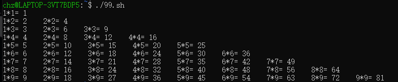
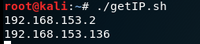
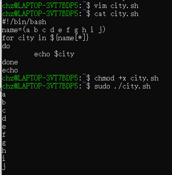
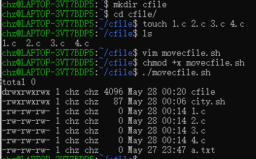
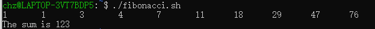
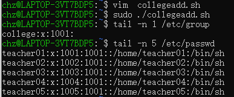
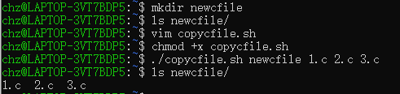
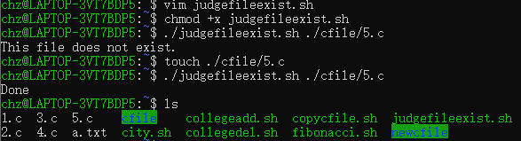
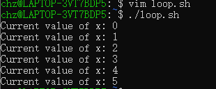

## 查看主机名：hostname

## 管道：

利用Linux所提供的管道符“|”将两个命令隔开，管道符左边命令的输出就会作为管道符右边命令的输入。连续使用管道意味着第一个命令的输出会作为第二个命令的输入，第二个命令的输出又会作为第三个命令的输入，依此类推。

注意：管道左边命令的输入作为管道右边命令的输入(命令的输入是一定的)，不是参数，并不是所有命令都支持管道

例子：ls | grep a  查看当前目录下名称包含a的文件或文件夹


- `命令1 | 命令2`：命令1的输出作为命令2的输入，eg `ls | grep aaa`
- `命令1 & 命令2`：命令1执行完毕后执行命令2，eg `cd aaa & ls`
- `命令1 || 命令2`：如果命令1执行失败则执行命令2


## 系统命令环境和配置

clear | 清屏

alias ii = “ls -l” | 添加别名

unalias ii | 清除别名

set 显示环境变量和普通变量 

env 显示环境变量 

export 把普通变量变成环境变量 

unset 删除一个环境变量

```bash
aaa(){} 定义函数
```

read 命令从标准输入中读取一行，并把输入行的每个字段的值指定给 shell 变量

```bash
-p  接提示字符
-t  接等待的秒数
```

declare、typeset

```bash
-i 声明为整数
-a 声明为数组
-f 声明为函数
-r 声明为只读
```


## 1  \$(), \$(())和\${}区别

+ $( ) 和``作用相同,命令替换:完成括号里的命令行,然后将其结果替换出来,再重组命令行。

- ${}用于变量替换. ${ } 会比$更精确的界定变量名称的范围
- $(())是用来作整数运算的


## 2  常用的shell有哪几种?

+ Bourne shell (sh)

- C shell (csh)
- Korn shell (ksh)
- Bourne Again shell (bash)

## 3  说明三种引号的作用有什么区别

+ "": 用双引号括起来的字符,除$,`,\,均作为普通字符对待

- '': 由单引号括起来的所有字符都作为普通字符出现
- ``: 倒引号用于命令替换

## 4  Shell编程题

### 入门示例：

```bash
#!/bin/bash
echo -n "IP: "
read IP
echo "you IP is:" $IP
```


shell脚本首行`#!/bin/bash`表示此脚本应该使用用`/bin/bash`来执行

`echo -n`表示不换行

从shell窗口读取输入字符，如：`read IP`，输入后使用`$IP`即可使用IP变量

为脚本增加执行权限：`chmod +x 文件名`


### for循环

#### 九九乘法表：

```bash
#!/bin/bash
for n in `seq 9`
do
	for m in `seq $n`
	do
		echo -n "$m*$n=" `expr $m \* $n`"    "
	done
	echo
done
```




#### 发现网段可ping通的IP地址


```bash
#!/bin/bash
ipheader=`ifconfig eth0 | grep "inet " | awk '{print $2}' | cut -d '.' -f 1-3`
for n in `seq 254`
do
	ping "$ipheader.$n" -c 1 | grep ttl | awk '{print $4}' | awk -F: '{print $1}'
done
```

能ping通的地址会打印出来




### 4.1  for循环打印数组

利用数组形式存放 10 个城市的名字，然后利用 for 循环把它们打印出来

```bash
vim city.sh
# 编辑city.sh文件
#!/bin/bash
name = (a b c d e f g h i j)
for city in ${name[*]}
do
    echo $city
done
echo
# 保存退出esc:wq
# 增加可执行权限
chmod +x city.sh
# 执行脚本
./city.sh
```




### 4.2  for循环移动文件

利用for循环将当前目录下的.c文件移到指定的目录下，并按文件大小排序，显示移动后指定目录的内容。

```bash
vim movecfile.sh
# 编辑movecfile.sh文件
#!/bin/bash
for file in $(ls  | grep -E "*.c$")
{
     mv ./$file ../
}
ls -lS ../
# 保存退出esc:wq
# 增加可执行权限
chmod +x movecfile.sh
# 执行脚本
./movecfile.sh
```




### 4.3  算术运算：求斐波那契数列的前10项及总和

```bash
vim fibonacci.sh
# 编辑fibonacci.sh文件
#!/bin/bash
let "a = 1"
let "b = 1"
echo -n -e "$a\t$b"
let "a = a + b"
for count in $(seq 0 3)
do
        let "a = a + b"
        let "b = b + a"
        echo -n -e "\t$a\t$b"
        let "n = a + b"
done
echo
echo "The sum is $n"
# 保存退出esc:wq
# 增加可执行权限
chmod +x fibonacci.sh
# 执行脚本
./fibonacci.sh
```




### 4.4  添加新用户组及其成员

添加一个新用户组为college,然后添加属于这个组的5个用户，用户名的形式为teacherxx,其中xx从01到05

```bash
#!/bin/bash
groupadd college
for id in $(seq -w 01 05)
do
        useradd -g college teacher$id
done
```

逆操作

```bash
#!/bin/bash
for id in $(seq -w 01 05)
do
        userdel teacher$id
done
groupdel college
```




### 4.5  文件复制

编写一个shell脚本，把第二个位置参数及其以后的各个参数指定的文件复制到第一个位置参数指定的目录中

```bash
#!/bin/bash
target=$1
shift
for file in $*
do
        cp $file ${target}/
done
```





### 4.6  if条件控制

文件存在，则拷贝文件然后打印出一个信息,文件不存在，则打印出一个信息然后离开

```bash
#!/bin/bash
if $(test -f $1)
then
        cp $1 .
        echo "Done"
else
        echo "This file does not exist."
        exit
fi
```





### 4.7  while循环

设定 x 初值为 0,每秒增加 x 的数值

```bash
#！/bin/bash
x=0
while [ "$x" -le 5 ]
do
        echo "Current value of x: $x"
        x=$(expr $x + 1)
        sleep 1
done
```





