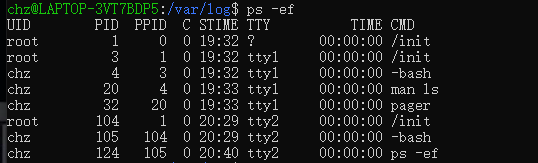
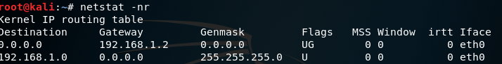
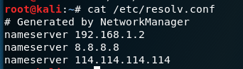

## 1  基本概念

系统管理员的职责包括哪些？管理的对象包括哪些？

系统管理员的职责是进行 系统资源管理、设备管理、系统性能管理、安全管理和系统性能监测

管理的对象是服务器、用户、服务器的进程及系统的各种资源等。

#### Linux系统概述

1. 请简述Linux操作系统有什么优点？
2. - 提供了先进的网络支持：内置TCP/IP协议;
    - 真正意义上的多任务、多用户作系统
    - 与UNIX系统在源代码级兼容，符合IEEE POSIX标准
    - 支持数十种文件系统格式
    - 开放源代码，用户可以自己对系统进行改进
3. Linux系统的特点
4. - 与UNIX兼容
    - 自由软件，源码公开
    - 性能高，安全性强
    - 便于定制和再开发
    - 互操作性高
    - 全面的多任务和真正的32位操作系统
    - 在服务器市场及嵌入式系统领域应用广泛，是一种高性能、低开支的可以替换其他昂贵操作系统的系统。
5. 查看系统信息：dmesg


#### Linux的安装

1. Linux 系统启动(引导)过程

2. 1. 内核的引导
    2. 运行 init
    3. 系统初始化
    4. 进入用户桌面(图形界面方式)或系统光标提示符(字符界面方式)
    5. 用户登录系统

3. Linux的运行级别(runlevel) 重点3,5

    这些级别定义在`/ect/inittab`文件中,是init程序寻找的主要文件

    标准的Linux运行级别为3或5

4. - 0: 系统停机状态，系统默认运行级别不能设置为0，否则不能正常启动，机器关闭.
    - 1: 单用户工作状态,root权限,用于系统维护,禁止远程登陆
    - 2: 多用户状态,没有NFS支持
    - 3: 完整的多用户模式，有NFS，登陆后进入控制台命令行模式
    - 4: 系统未使用，保留一般不用，在一些特殊情况下可以用它来做一些事情
    - 5: X11控制台，登陆后进入图形GUI模式
    - 6: 系统正常关闭并重启


## 2  磁盘管理

`du` - 对文件和目录磁盘所使用的空间的查看

`df` - 报告文件系统磁盘空间的使用情况

du命令可以显示目前的目录所占用的磁盘空间，df命令可以显示目前磁盘剩余空间。

 

如果du命令不加任何参数，那么返回的是整个磁盘的使用情况，如果后面加了目录的话，就是这个目录在磁盘上的使用情况。


du -hs 指定目录  查看指定目录的总大小

du -hs ./* 查看当前目录下的所有文件夹和文件的大小

 

这两个命令都支持-k，-m和-h参数，-k和-m类似，都表示显示单位，一个是k字节一个是兆字节，-h则表示human-readable，即友好可读的显示方式。

`mount` - 挂载指定的文件系统到指定的挂载点


## 3  Linux桌面系统及配置

1. 常见的窗口管理器
2. - GNOME
    - KDE
    - TWM

 


## 4  基本目录说明


- `/bin`: 必要的用户二进制可执行文件(被所有用户使用)
- `/sbin`: System binaries`/sbin`包含启动，恢复，恢复和/或修复系统以及`/bin`中的二进制文件所必需的二进制文件
- `/boot`: 系统启动时要用到的静态文件
- `/usr`: 是文件系统的第二个主要部分. `/usr`是可共享的只读数据.
- `/dev`：dev是Device(设备)的缩写,包含设备和特殊文件
- `/proc`: Linux处理进程和系统信息的标准方法,用于存储和检索进程信息以及其他内核和内存信息.
- `/etc`: 主机特定的系统配置
- `/lib`: 这个目录里存放着系统最基本的动态链接共享库，其作用类 似于Windows里的DLL文件。几乎所有的应用程序都需要用到这些共享库.

##  5  进程管理

**top：显示操作系统进程信息，类似Windows的任务管理器**


在该界面下可以直接输入kill pid杀死其中的进程，按`q`退出界面


ps：显示进程信息


ps -ef：显示更详细的进程信息




ps aux：类似ps -ef，但有一些列是不同的


## 6  网络管理


ifconfig | 查看当前网络配置信息


lo  本地环回

etho  本地网卡

关闭网卡：`ifconfig eth0 down`，在修改网卡mac地址前需要执行此操作

启动网卡：``ifconfig eth0 up`

更改mac地址（只在本次登陆有效）：`macchanger -m 00:11:11:11:11:11 eth0`


查看本地DNS server：cat /etc/resolv.conf 


netstat -pantu：查看tcp/udp连接

打开浏览器浏览网页，再用此命令查看：


使用管道筛选调0.0.0.0，并只显示源地址和目标地址

`netstat -pantu | egrep -v '0.0.0.0|:::' | awk '{print $4" " $5}'`


筛选目的地址（不包括端口号）并排序，重复只显示一次

`netstat -pantu | egrep -v '0.0.0.0|:::' | awk '{print $5}' | egrep -v 'and|Address' | cut -d ':' -f 1 | sort | uniq`

这些IP信息可以利用`>`或`>>`管道符存进文件中保存起来


route：路由操作命令


### 网络配置

#### 临时网络配置

动态获取IP地址：`dhclient eth0`


修改IP地址：`ifconfig eth0 ip/子网掩码`，如`ifconfig eth0 192.168.1.5/24`，修改之前需要down一下网卡：`ifconfig eth0 down`；

仅仅修改IP地址往往会破环网络连接，接下来需要指定网关：`route add default gw 192.168.1.1`

使用`netstat -nr`查看效果



添加静态路由（可选）：`route add -net 172.16.0.0/24 gw 192.168.1.100 eth0`；

配置DNS服务器：`vi /etc/resolv.conf`

添加DNS服务器信息：nameserver DNSIP地址



修改完成后启动网卡：`ifconfig eth0 up`；


#### 永久生效（编辑网卡配置文件）

```bash
# 备份

# 编辑
vi  /etc/network/interfaces
# 增加内容
auto eth0
iface eth0 inet static
address 192.168.1.128
netmask 255.255.255.0
gateway 192.168.1.2
# 可选
network 192.168.20.0
broadcast 192.168.20.255
dns-nameservers 192.168.1.1 8.8.8.8

# 静态地址
up route add -net 172.16.5.0/24 gw 192.168.10.100 eth1
down route del -net 172.24.0.0/24
```


## 操作系统运行级别

运行级别0-6

重启操作系统：`init 6`

关闭操作系统：`init 0`


